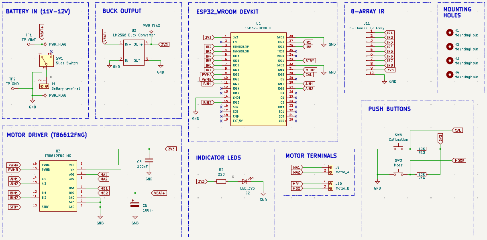
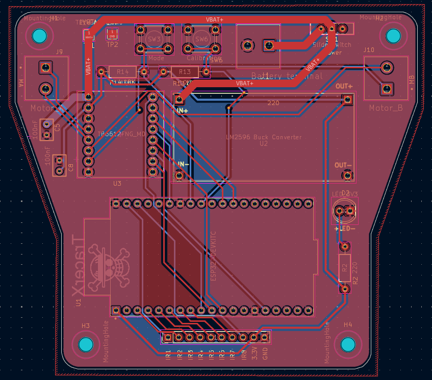
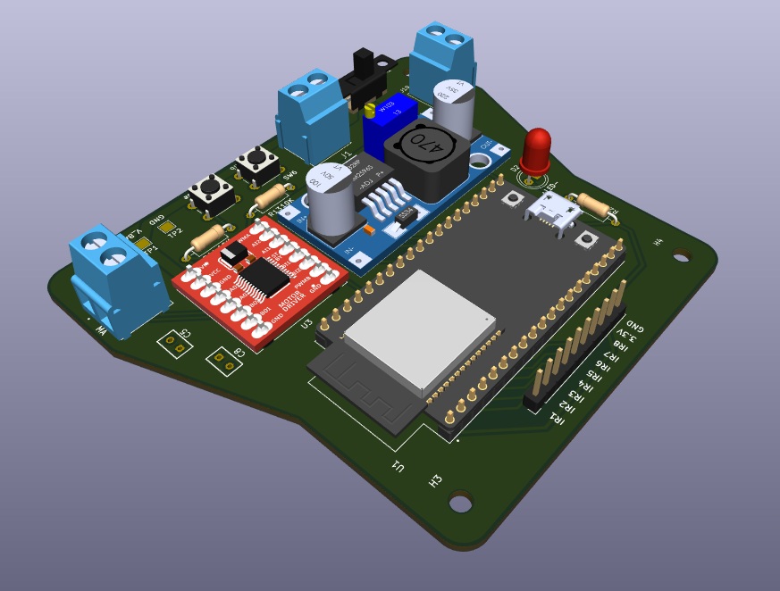

# 🤖 ESP32 Line Follower Robot — Hardware Design
*A compact and efficient line follower robot built using the ESP32*

This project showcases the schematic and PCB design of a reliable line follower robot capable of high-speed tracking with stable power delivery and clean motor control. It is designed as a practical exploration of real-world embedded hardware development and PCB design workflows.

---

## ⚙️ Working Principle

- The **ESP32 DevKit (38-pin)** acts as the main controller.
- An **8-channel IR sensor array** detects the line:
  - **6 sensors operate in analog mode** for precise position tracking.
  - **2 sensors operate in digital mode** for edge detection.
- The **TB6612FNG motor driver** controls two DC motors with efficient PWM-based speed regulation.
- A **LM2596 buck converter** steps down the battery voltage to provide a stable **3.3V rail** for the ESP32 and logic circuitry.
- Two push buttons allow:
  - **Calibration mode** – tune sensor thresholds.
  - **Mode selection** – switch between operating behaviors.
- Decoupling capacitors and a ground plane ensure noise reduction and power stability.

---

## 🎯 Objective

To design and develop a robust hardware platform for a line follower robot that demonstrates:

- Proper power architecture  
- Motor driver integration  
- Mixed analog/digital sensing  
- Clean PCB layout practices  
- Expandable embedded design  

---

## 🔧 Hardware Overview

| No. | Component | Role |
|------|------------|--------|
| 1 | ESP32 DevKit (38-pin) | Main microcontroller with Wi-Fi & BLE |
| 2 | TB6612FNG | Dual motor driver |
| 3 | LM2596 Buck Converter | Efficient voltage regulation |
| 4 | IR Sensor Array (8-channel) | Line detection |
| 5 | Push Buttons (2x) | Calibration & mode selection |
| 6 | Battery Input + Slide Switch | Power control |
| 7 | Capacitors | Filtering & decoupling |
| 8 | Mounting Holes | Mechanical stability |

---

## 🔋 Power Architecture

**Battery → Slide Switch → LM2596 Buck → 3.3V Rail**

Design considerations:

✅ Wide power traces for motor current  
✅ Dedicated ground plane  
✅ Local decoupling near driver and ESP32  
✅ Separate motor and logic routing where possible  

---

## 📷 Preview

### 🖼️ Schematic  

### 📐 PCB Layout  

### 🧊 3D View  

---

## ⭐ Key Features

✅ Stable buck-regulated power supply  
✅ High-efficiency TB6612FNG motor control  
✅ Mixed analog + digital sensor interface  
✅ Compact 2-layer PCB  
✅ Ground plane for noise reduction  
✅ Designed following practical PCB routing guidelines  

---

## 🧠 Design Notes

- Motor traces are sized to handle higher current.
- Ground return paths are optimized using copper pour.
- Mounting holes are included for chassis integration.
- Connectors are placed for easy wiring and maintenance.

---

## 🚀 Future Improvements

- PID tuning for smoother tracking  
- Encoder-based speed feedback  
- Bluetooth / Wi-Fi telemetry  
- Battery voltage monitoring  
- On-board charging circuit  
- Custom buck stage instead of module  
- Fully integrated motor + sensor board  

---

## 📚 Learning Outcomes

This project helped strengthen understanding of:

- Power electronics in embedded systems  
- PCB stackup and routing  
- Grounding strategies  
- Motor driver layout considerations  
- Hardware debugging practices  
